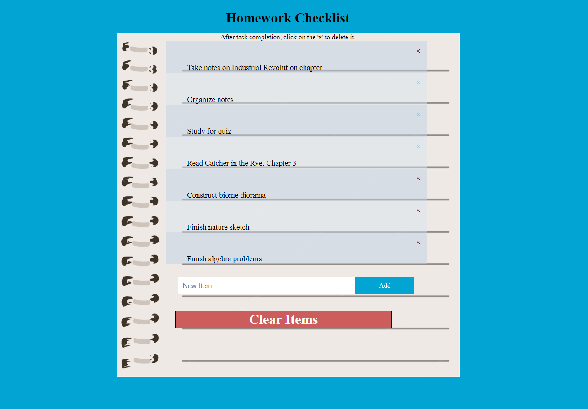

# homework-list-2.0

Create a to-do list of items that correspond to your homework assignments.



## Objective

In this project, we will be using DOM to create and modify existing HTML elements.

Difficulty: Intermediate

## Prerequisites

To complete this project, students should have the following:

* Basic understanding of HTML structure and attributes.
* Basic understanding of CSS properties.
* Basic understanding of JavaScript and DOM.

## Part 1

Create the following:
* HTML file
* CSS file
* JS file

Link all of your files correctly.

## Part 2: Create a "close" button and append it to each list item

1. Create an array that gets all the elements with tag name "li"

2. Create a for-loop that iterates from var i = 0 to the length of the array

Inside the for-loop:

3. Create a variable called 'span' and store in it a new element with the tag name "span"
   * ex: var span = document.createElement("span");
 
4. Create a variable called 'txt' and store in it a new text node of the unicode for the multiplication sign, which looks like "x". The unicode for the multiplication sign is "\u00D7"

5. Set the class name of the span variable equal to "close"

6. Append the txt variable as the child node to span
    *	 ex: span.appendChild(txt)
    
7. Append the span variable as the child node to the array element at index i
    *  ex: arr[i].appendChild(span)

## Part 3: Add “close” button functionality

1. Create an array called 'close' that gets all the elements with class name "close"
    * ex: var close = document.getElementsByClassName("close")
   
2. Create a for-loop that iterates from var i = 0 to the length of the close array

Inside the for-loop:

3. Create a function that takes no parameters.

    Inside the function:
 
    1. Create a variable called 'div' and set it to "this.parentElement"
     
    2. Set the style.display attribute of the div variable to "none"
          * ex: variable.style.display = "none"
     
     
    3. Close your function!
     
4. Set the array element at index i to the function, when clicked.
    * ex: close[i].onclick = functionName()


Your completed Part 2 should look like this:

```JavaScript
var close = document.getElementsByClassName("close");

for (i = 0; i < close.length; i++) {
  close[i].onclick = function() {
    var div = this.parentElement;
    div.style.display = "none";
  }
}
```

## Part 4: Copy and paste this code to check off the list item when clicked

```javascript
var list = document.querySelector('ul');
list.addEventListener('click', function(ev) {
if (ev.target.tagName === 'LI') {
ev.target.classList.toggle('checked');
}
}, false);
```

## Part 5: Create a new list item when “add” button is clicked

1. Create another function that takes no parameters.

Inside the function:

2. Create a variable called 'li' that creates an element with the tag name "li"

4. Create a variable called 'inputValue' that gets the value of the element with the ID "myInput"

6. Create a variable called 'newText' that creates a text node containing the inputValue variable

8. Append the newText variable as the child to the li variable

    
6. To check if the input value is valid, create an if-else statement, which checks if the input value is blank
    1. if the inputValue === '', then write an alert telling the user they must type something.
    2. Else, then input is considered valid. Append the li variable as the child to the element with ID "myUL"

7. Set the value of the element with ID="myInput" to ""

9. Create a variable called 'span' and store in it the new element of the tag name "span"

11. Create a variable called 'txt' and store in it a new text node of the unicode for the multiplication sign, which looks like "x". The unicode for the multiplication sign is "\u00D7"
 
13. Set the class name of the span variable equal to "close"

15. Append the txt variable as the child node to span
    * ex: span.appendChild(txt)
  
16. Append the span variable as the child node to the li variable
    * ex: li.appendChild(span)

13. Create the same for-loop from Part 3 using Lines 2-4.

15. Close your function!

## Part 6: Create the removeAll() function to add functionality to the “Clear Items” button

1. Create a function called 'removeAll' that takes no parameters.

Inside the function:

2. Create an array called 'list' and store in it all the elements with the tag name "ul"

4. Set the list[0].innerHTML to an empty string ""


